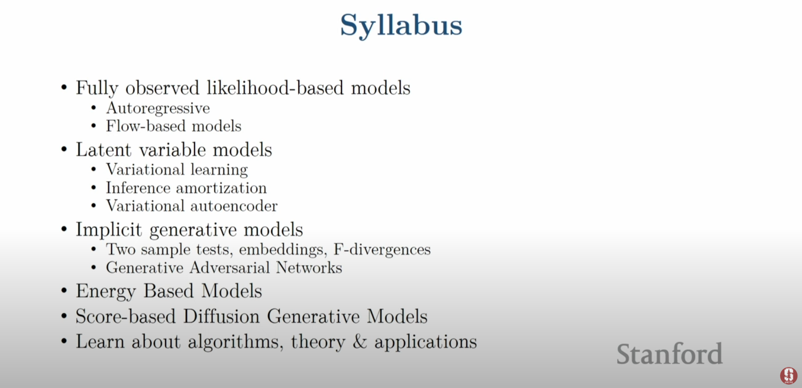
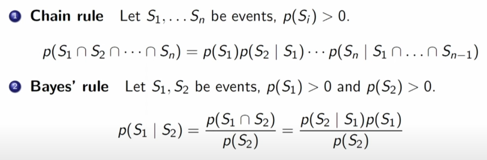
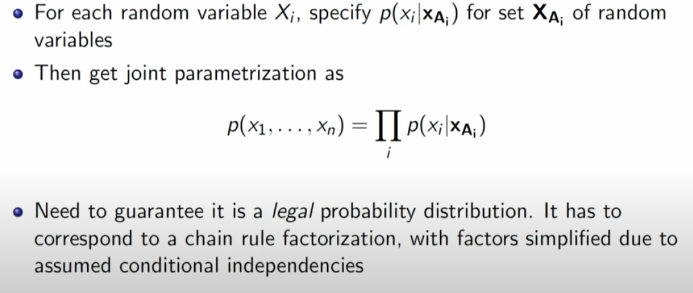
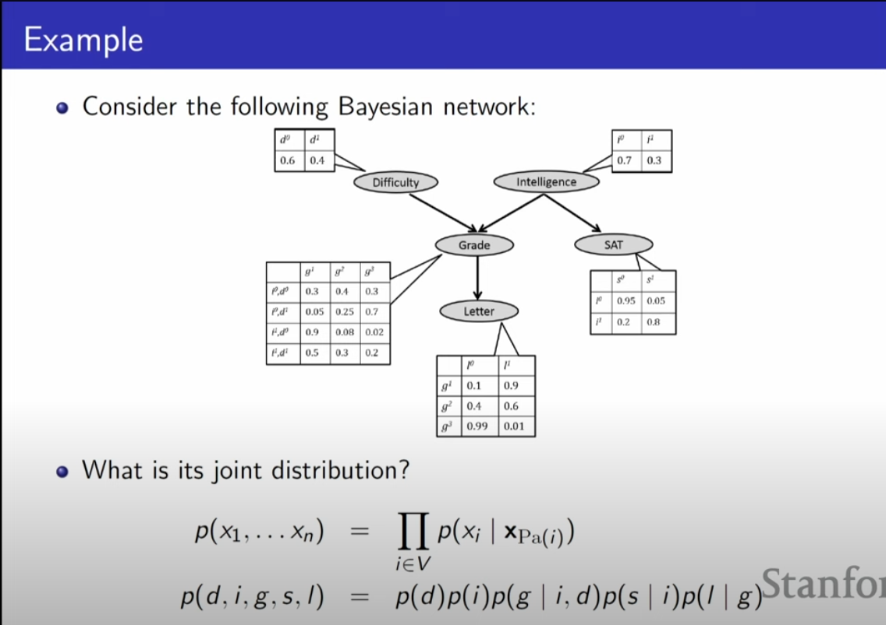
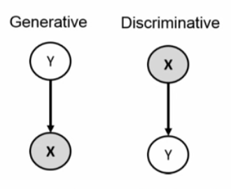
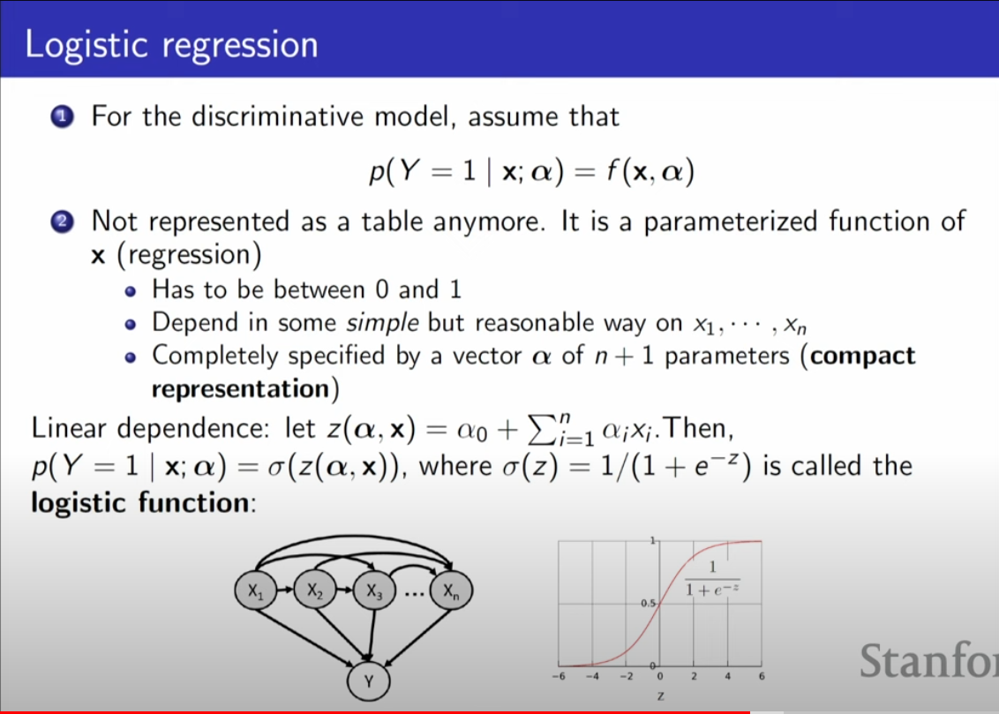
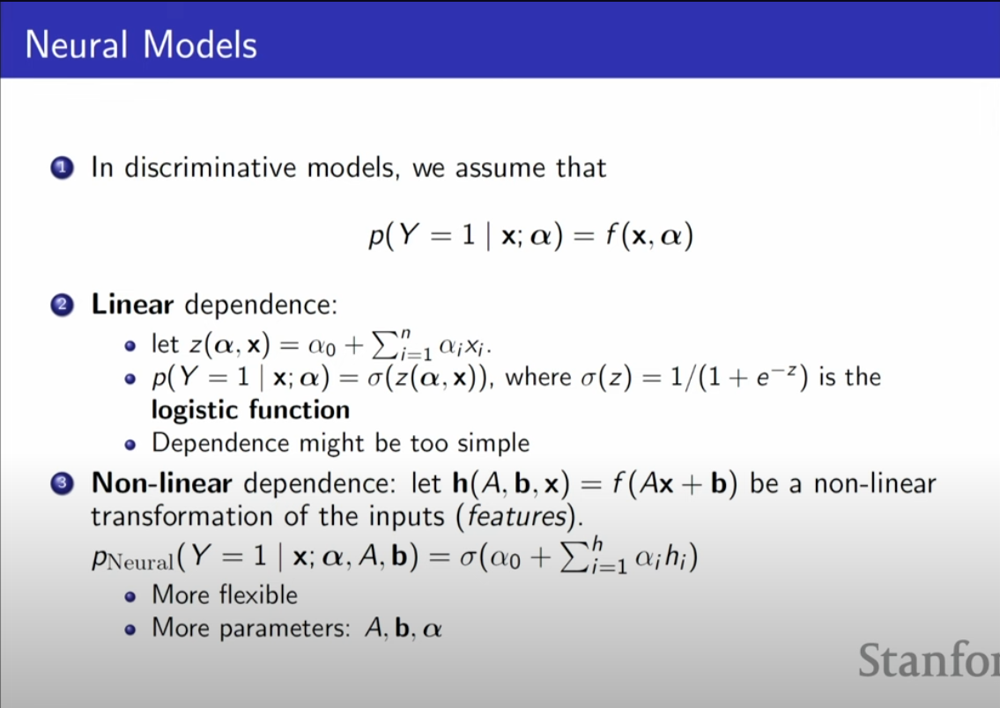

# Lecture 1

[can be acessed here!](https://www.youtube.com/watch?v=XZ0PMRWXBEU&list=PLoROMvodv4rPOWA-omMM6STXaWW4FvJT8&index=1)

## Richard Feynman:

- What i cannot create, i do not understand"

In generative models, "What i understand, i can create"!
if we understando how to representante an image, like a cube, showing her high level description, for example, like her shape, her color, position, size, etc, we have an understanding for the concept of a cube. Inverting this vision, we can make a inference about the structure of this image, this cube.
Many of the models will have this structure, with a generation + inference, with features, representations.

## Statistical Generative models

This models learn from data, using images of bedrooms for example, and prior knowledge, like physics and materials.
Priors are always necessary, but there is a spectrum about it.

Like any statistical model, a statistical generative model is a probability distribution p(x).
Her components, like writed in last phrases, are a compound of samples of data (like images of bedrooms), and prior knowledge, like her parametric form (Gaussian?), loss function (maximum lieklihood?), an optimization algorithm, etc, and this combination with a good data will give us a good statistical generative model.
basically, it is generative, because sampling from an scalar probability distribution p(x), after training him with images + a probability distribution, when we sampling from p(x), it give us new images

## Building a simulator for the data generating process

to generate new data, we have to use a structure:

Control Signals -> Data Simulator -> New Datapoints

the control signals can be phrases in english, for example, and the data simulator will be a structure with statistical generative models, generatin images at new data points. It give us this new structure:

(Control signals + potential datapoints) -> (Generative model(s)) -> (New Datapoints + Probability Values)

At this point, Generative Models will be defined as neural networks, an architecture of deep learning models, who give us capabilities of generating models

## Data generation in the real world

Giving us examples, like an raw painting of a room with windows, tv and a bedrom, maybe give us images, after an generative model of realistic images.
Maybe, using a vector of worlds, can give us images with this topic.

### Outlier detection with generative models

if you can train a generative model with traffic signs, and try to inference if a modified version of it was true, you can see a low probability of the modified version gonna be a true signal, asking help for a human, for example.

### Progress in Generative Models of Images (GANs)

Generative Adversarial Networks was giving us better results since 2015: the last ones, at 2021, give us extremelly really images, but with generated images of humans, for examples.

### Text2Image Diffusion Models

In this type of model, you can give a text, and his answer was an image, using diffusion networks. this models was trained in a lot of images+texts, @ internet.

Dalle3 are a great example! it give us incredible images with text.

### Inverse problems

At this example, when we try to give a better resolution, an remove of masks or problems with a image, or give us a color image from a greyscaled one, it works perfectrly. Giving a better or a real image from a sketch/raw image, between another images examples.
Models can edit images too - giving us a children drawing of a image, or fitting a dog in a different position, etc.

### WaveNet

give us an text-to-speech example, directly from 2016.

@ 2023, we have a Diffusion Text2SPeech, with a more realistic model.
derivated from this models, we have Audio Super Resolution models, for example, as an inverse problem resolution.

### Language Generation

models trained from internet data, giving us responses from a prompt, inferencing the most probability word after one, like P(next word | previous words).
how newer the model was, with more data and more data trained, an better understanding of the concepts and context it looks like.

### Machine Translation

give us the response of P(English Text | Chinese Text)

### Video Generation

Training an model to give us a video from text, for example.

### Imitation Learning

Conditional generative model, P(actions | past observations). if u give good examples to a model, it can learn how to do it, like playing a car race videogame, learning to not crash into another cars, or to stack objects, learning policies

### molecule generation

design drugs or better catalysts with generative models, training him with informations of molecules, particles, and designing a new one from mpast informations and knowledges. it use diffusion and autoregressive models too.

## Roadmap and key challenges

### Representation

- how we do the model joint distribution of many random variables?
    - Need compact representation

### Learning

- What is the right way to compare probability distributions?

Pdata -> d(Pdata, P0) -> P0, 0 e M (models), we cant choose models who give us different distributions from the original data! 

### Inference

- How do we invert the generation process (vision as inverse graphics)?
    - Unsupervised learning:
        - recover high level descriptions (features) from raw data

</img>

### Prereqs

- Basic knowledge about ML, at least one from CS 221, 228, 229, 230;
- Probabilities and calculus
    - Gradients, Gradient-Descent, Optimization, backpropagation
    - Random variables, independence, conditional dependence
    - Bayes Rule, chain rule, change of variables formulas
- Proficiency in some programming languages, preferably Python

## More details
[Class webpage can be acessed here](https://deepgenerativemodels.github.io/), who contains some reading materials, course notes, lecture notes and [an online version of Deep Learning, by Goodfellow, Bengio and Courville](https://www.deeplearningbook.org/)

## About project

- it have to fall into one or more of this categories:
    - Application of deep generative models on a novel task/dataset.
    - Algorithmic improvements into the evaluation, learning and/or inference of deep generative models.
    - Theoretical analysis of any aspect of existing deep generative models.

# Lecture 2

## What is a generative model

### Learning a generative model

- with a set of examples, like images, texts, audio, etc, knowing that is a representation of some distribution, becoming of a specific background, seed. We known this dataset have a distribution, but we dont know what distribution it is.
That distribution can be a lot complex, and if you think you have another distributions, like the model who can represent a distribution (or a family of models who can represent that), you can add another layer of complex thinks.

- So, on a generative model, we want to learn a probability distribution p(x) over images x such that:

    - Generation: If we sample Xnew ~ p(x), should like a dog (sampling)
    - Density estimation: p(x) should be high if x looks like a dog, and low otherwise (anomaly detection)
    - Unsupervised representation learning: We should be able to learn what these images have in common, like how a dog looks like, with ears, tail, etc (features)

- First questiion: how to represent p(x)?

#### Basic discrete distributions:

##### Bernoulli distribution

- like a (biased) coin flip, it comes with two binary categories
    - D = {Heads, Tails}
    - Specify P(X=Heads) = p. then P(X=Tails) = 1 - p
    - Write X~Ber(p)
    - Sampling: flip a (biased) coin

##### Categorical distribution

- like a (biased) m-sided dice
    - D = {1,...,m}
    - Specify P(Y=i)=pi, such that (sum)pi = 1
    - Write Y~Cat(p1,...,pm)
    - Sampling: roll a (biased) dice

##### Joint distribution

- Modeling a single pixels color:
    - Red Channel R, Val(R) = {0,..., 255}
    - Green Channel G, Val(G) = {0,..., 255}
    - Blue Channel B, Val(B) = {0,..., 255}
    - Sampling from the join distribution (r,g,b) ~ p(R,G,B) randomly generates a color for this pixel.
    - to specify an probability of the joint distribution p(R=r, G=g, B=b): 255*255*255-1

Example:
In MNIST dataset, we have a lot of images of number with a specific pixel quantity.
Val(Xi) = {0,1} = {Black, White}
Possible states = {2*2*2....*2} = 2^n, n times.
sampling from p(x1,...,xn) generates an image
parameters will be 2^n - 1!

#### Structure through independence

- if X1, ..., Xn are independent, then p(X1,...,Xn) = p(x1)*p(x2)...p(xn)
- possible states = 2^n
- 2^n entries can be described by n numbers if |Val(Xi)|=2!

### Chain Rule & Bayesian Rule

</img>

it can be used to determine the probability of a sequence of words happenin, pixels, etc, a lot of random variables can be factorized with it.
Essentialy, chain rule can determine the probability, given a marginal distribution of data, of a sequence of things:
- p(x1,...,xn) = p(x1)p(x2|x1)p(x3|x1,x2)...p(xn|x1,...,xn-1)
- How many parameters? 1+2+...+2^(n-1) = 2^n -1
    - p(x1) requires 1 parameter
    - p(x2|x1=0) requires 1 parameter, p(x2|x1=1) requires 1 parameter
        - Total, 2 parameters

with a markov model, you can predict the next word, but it cannot give a context at training time.

### Bayes Network

- It uses conditional parametrization, instead of joint parametrization:

</img>

- It is a data structura, graph-based, specified by a directed acyclic graph (DAG) G=(V,E), with:
    - One node i e V, for each random variable Xi
    - One conditional probability distribution (CPD) per node, specifying the var probability conditioned on its parents values
- THe Graph G=(V,E) is called the structure of the Bayesian Network.
- A simplified representation are |Pa(i)|, not |V|

</img>

- essentially, with Bayes Network, we can resume a chain rule were every member have a dependence each other, based on the independence of some factors, so we can simplify the chain rule.

### Naive Bayes for single label prediction

- with a training dataset like emails, tryin to classify as a spam or not, we can estimate parameters from training data with Bayes rule.
    - given each probability to be a spam, we calculate how much each word appear, enabling a sum of each probability multiplied by each other.

### Discriminative vs generative:

- With a chain rule p(Y,X) = p(X|Y)p(Y) = p(Y|X)p(X)
- Corresponding Bayesian Networks:
    </img>
- modelling X -> Y can be very difficult/complex, since we have a lot of details to capture with a network.

Example with p(Y,X)?
Logistic Regression!
It give us the probability of Y happen, given a set of data X, using a logit function (or sigmoid):
    </img>
With this condition, we make a weaker statement about the relationship of the variables, since X was related to y, but not vice-versa.
a point is, a logistic regression model doesnt assume independence between variables, inlike naiuve bayes. this can make a big difference in applications.

Essentially, when using distriminative models, you cant input missings with that model, because you havent traiined a model to identify this distribution. Using generative models, you can archive that mission!

### Neural Models

we can think a neural model, with:
    </img>

Stacking that network with a linear dependence between a input of features, the results from another layer, and weights random initializeds, and a bias, inside a logistic function, giving another layer of linear dependences, we can make a single neural network!

Repeat it, and we have a neural network, more flexible to non-linear dependences, but in a logistic function for giving us probabilites, too.

### Bayesian networks vs neural models

- using chain rule,
- we can make a Bayes Network:
</img>
- and, applyin neural models, we can make a generative network, specifically giving a autoregressive assumption/condition to the neural network, addin a chain rule to our results, with a dependency of another layers/results/variables:
</img>

### Continuous variables

- we can mix different distributions around a Bayesian Network, or a Neural Network, factorizing it with Bayes chain rule.
An example is Variational autoencoder, who are a Bayes net Z -> X, with factorization, pz,x(z,x) = pz(Z)px|z(X|Z), ZN(0,1), and X|(Z=z)~N(u0(z), e^0(z)), variances and means, from a gaussian distribution.
At this example, a neural network was used inside the gaussian term, with weigths 0,o, using her results to determine Z give x values.