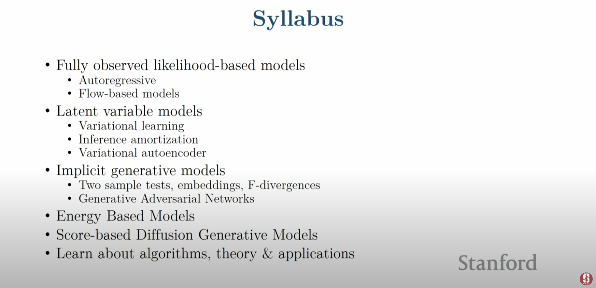

# Lecture 1

[can be acessed here!](https://www.youtube.com/watch?v=XZ0PMRWXBEU&list=PLoROMvodv4rPOWA-omMM6STXaWW4FvJT8&index=1)

## Richard Feynman:

- What i cannot create, i do not understand"

In generative models, "What i understand, i can create"!
if we understando how to representante an image, like a cube, showing her high level description, for example, like her shape, her color, position, size, etc, we have an understanding for the concept of a cube. Inverting this vision, we can make a inference about the structure of this image, this cube.
Many of the models will have this structure, with a generation + inference, with features, representations.

## Statistical Generative models

This models learn from data, using images of bedrooms for example, and prior knowledge, like physics and materials.
Priors are always necessary, but there is a spectrum about it.

Like any statistical model, a statistical generative model is a probability distribution p(x).
Her components, like writed in last phrases, are a compound of samples of data (like images of bedrooms), and prior knowledge, like her parametric form (Gaussian?), loss function (maximum lieklihood?), an optimization algorithm, etc, and this combination with a good data will give us a good statistical generative model.
basically, it is generative, because sampling from an scalar probability distribution p(x), after training him with images + a probability distribution, when we sampling from p(x), it give us new images

## Building a simulator for the data generating process

to generate new data, we have to use a structure:

Control Signals -> Data Simulator -> New Datapoints

the control signals can be phrases in english, for example, and the data simulator will be a structure with statistical generative models, generatin images at new data points. It give us this new structure:

(Control signals + potential datapoints) -> (Generative model(s)) -> (New Datapoints + Probability Values)

At this point, Generative Models will be defined as neural networks, an architecture of deep learning models, who give us capabilities of generating models

## Data generation in the real world

Giving us examples, like an raw painting of a room with windows, tv and a bedrom, maybe give us images, after an generative model of realistic images.
Maybe, using a vector of worlds, can give us images with this topic.

### Outlier detection with generative models

if you can train a generative model with traffic signs, and try to inference if a modified version of it was true, you can see a low probability of the modified version gonna be a true signal, asking help for a human, for example.

### Progress in Generative Models of Images (GANs)

Generative Adversarial Networks was giving us better results since 2015: the last ones, at 2021, give us extremelly really images, but with generated images of humans, for examples.

### Text2Image Diffusion Models

In this type of model, you can give a text, and his answer was an image, using diffusion networks. this models was trained in a lot of images+texts, @ internet.

Dalle3 are a great example! it give us incredible images with text.

### Inverse problems

At this example, when we try to give a better resolution, an remove of masks or problems with a image, or give us a color image from a greyscaled one, it works perfectrly. Giving a better or a real image from a sketch/raw image, between another images examples.
Models can edit images too - giving us a children drawing of a image, or fitting a dog in a different position, etc.

### WaveNet

give us an text-to-speech example, directly from 2016.

@ 2023, we have a Diffusion Text2SPeech, with a more realistic model.
derivated from this models, we have Audio Super Resolution models, for example, as an inverse problem resolution.

### Language Generation

models trained from internet data, giving us responses from a prompt, inferencing the most probability word after one, like P(next word | previous words).
how newer the model was, with more data and more data trained, an better understanding of the concepts and context it looks like.

### Machine Translation

give us the response of P(English Text | Chinese Text)

### Video Generation

Training an model to give us a video from text, for example.

### Imitation Learning

Conditional generative model, P(actions | past observations). if u give good examples to a model, it can learn how to do it, like playing a car race videogame, learning to not crash into another cars, or to stack objects, learning policies

### molecule generation

design drugs or better catalysts with generative models, training him with informations of molecules, particles, and designing a new one from mpast informations and knowledges. it use diffusion and autoregressive models too.

## Roadmap and key challenges

### Representation

- how we do the model joint distribution of many random variables?
    - Need compact representation

### Learning

- What is the right way to compare probability distributions?

Pdata -> d(Pdata, P0) -> P0, 0 e M (models), we cant choose models who give us different distributions from the original data! 

### Inference

- How do we invert the generation process (vision as inverse graphics)?
    - Unsupervised learning:
        - recover high level descriptions (features) from raw data

</img>

### Prereqs

- Basic knowledge about ML, at least one from CS 221, 228, 229, 230;
- Probabilities and calculus
    - Gradients, Gradient-Descent, Optimization, backpropagation
    - Random variables, independence, conditional dependence
    - Bayes Rule, chain rule, change of variables formulas
- Proficiency in some programming languages, preferably Python

## More details
[Class webpage can be acessed here](https://deepgenerativemodels.github.io/), who contains some reading materials, course notes, lecture notes and [an online version of Deep Learning, by Goodfellow, Bengio and Courville](https://www.deeplearningbook.org/)

## About project

- it have to fall into one or more of this categories:
    - Application of deep generative models on a novel task/dataset.
    - Algorithmic improvements into the evaluation, learning and/or inference of deep generative models.
    - Theoretical analysis of any aspect of existing deep generative models.